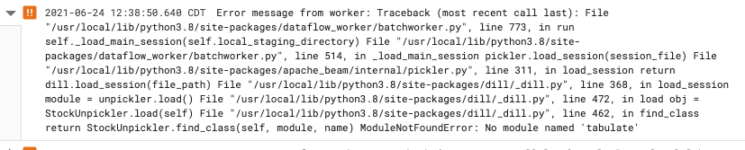
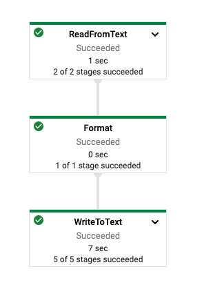

# Using Python Beam pipelines with containers

This repo will show how to specify a custom container image using DataflowRunner and install packages in the pipeline that are baked into the container image.

Dataflow workers have many pre-installed packages for the Python SDK. To demonstrate using a package that does not come pre-installed, I used the tabulate package used for formatting output/pretty print. 

The pipeline is very simple. It installs the package, reads lines from an input file, formats the input using tabulate, and outputs the result into a file. An example of the input.txt file is:

```text
John Doe 001 98034
Alice Ryan 002 67678
Bob Riley 003 23450
```

An example of the formatted output is:
```text
----  ---  ---  -----
John  Doe  001  98034
----  ---  ---  -----
-----  ----  ---  -----
Alice  Ryan  002  67678
-----  ----  ---  -----
---  -----  ---  -----
Bob  Riley  003  23450
---  -----  ---  -----
```

I've included a setup.py file to demonstrate the use of a multi-file pipeline.
To execute this pipeline, run
```bash
python -m tabulate_example  --input $INPUT \
                            --output $OUTPUT \
                            --runner DataflowRunner \
                            --project $PROJECT_ID \
                            --region $REGION \
                            --staging_location $STAGING_LOCATION \
                            --temp_location $TEMP_LOCATION \
                            --experiment $EXPERIMENT \
                            --job_name $JOB_NAME \
                            --worker_harness_container_image $WORKER_HARNESS_CONTAINER_IMAGE \
                            --setup_file ./setup.py
```

Keep in mind that Dataflow requires Python version ['3.6', '3.7', '3.8'].

## Implementation Notes
When running without a container, the job fails (as expected) with the following error:



After specifying the custom container in the PipelineOptions, the job runs successfully. 



## Docker Image
The Dockerfile for the image is below:
```dockerfile
# Base Image
FROM apache/beam_python3.8_sdk:2.25.0
 
#Install Dependencies
RUN pip install tabulate

```

This image was pushed to Container Registry. 
